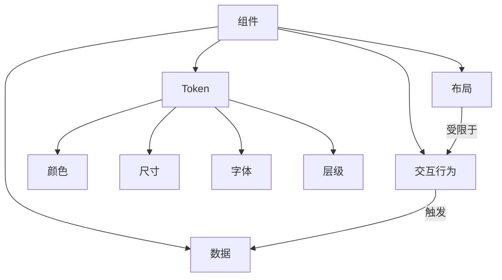

# 组件设计规范

查看 [README.md](./README.md) 获取英文版本.

## 1. 组件组成

组件由以下五个核心未读构成

| 维度     | 描述                                                                                                | 示例 |
| -------- | --------------------------------------------------------------------------------------------------- | ---- |
| 数据     | 使用 checkbox radio 表单元素、focus hover css 伪类，记录组件状态 抽屉组件是否弹出、下拉组件是否激活 |      |
| 交互行为 | 在特定情况下，展示，或隐藏元素。予以用户交互反馈                                                    |      |
| 布局     | 被交互行为决定的结构，及子元素排列方式                                                              |      |
| Token（代币） | 定义视觉与尺度原语（颜色、尺寸、字体和层级）。尺寸 token 限定组件尺寸，颜色 token 增强交互反馈；字体和层级 token 定义排版尺度和堆叠/层次关系。 |      |

由于实际开发过程中，部分组件的交互行为会决定视觉效果。

故将视觉效果分离为三个部分。

其中，布局是被交互行为决定的结构。Token（颜色、尺寸、字体、层级）作为独立的设计原语，不直接依赖于单一组件的交互逻辑。

## 2. 维度边界规范

### 2.1 交集处理原则

- 布局与 Token

  例如，card 可以使用单独的尺寸 token（大/中/小）。圆角和结构细节应作为布局的一部分，而不放在尺寸 token 中。

  颜色 token（例如 `paperPrimary`、`paperSecondary`）用于跨组件的语义色。像 `preview` 这样的布局可以组合颜色 token 与布局特定的背景（如重复的圆点）。

## 3. 设计原则

1. 明确边界：文档中标注布局与交互行为的关系
2. 可扩展性：Token（颜色、尺寸、字体、层级）应可组合并支持多种组合
3. 单一职责：Token 应只承担单一职责；例如尺寸 token 控制尺度，颜色 token 控制语义色值

## 4. CSS 选择器规范

1. **选择器权重原则**
   - 默认情况下，选择器优先级应尽可能低
   - 避免使用ID选择器（`#id`）
   - 优先使用类选择器（`.class`）和元素选择器
   - 减少选择器的嵌套层级

2. **组件内聚场景**
   - 当处理组件内部相关的样式时，允许使用组件相关的特定选择器
   - 组件作用域内的选择器可以有适当的特异性
   - 选择器应清晰表达组件的结构关系

3. **最佳实践**
   - JavaScript 变量命名应反映组件的五个核心维度：
     - 基础布局：使用组件名作为基础，如 `card`
     - 数据状态：使用状态描述，如 `cardActive`, `cardOpen`
     - 交互行为：使用行为描述，如 `cardInteractive`, `cardHoverable`
    - Token 变体：对外暴露 `color`、`size`、`font`、`layer` 的 token 变体。例如：`cardSmall`（尺寸 token）、`cardPrimary`（颜色 token）、`bodyFont`（字体 token）、`elevationLayer`（层级 token）。
   - 使用 Sprinkles 处理可组合的样式变体，如 `cardSprinkles`
   - 避免使用全局样式和 `!important`
   - 确保变量名清晰表达样式的用途和所属维度
   - 保持样式定义的独立性和可维护性

# FOUC 问题
