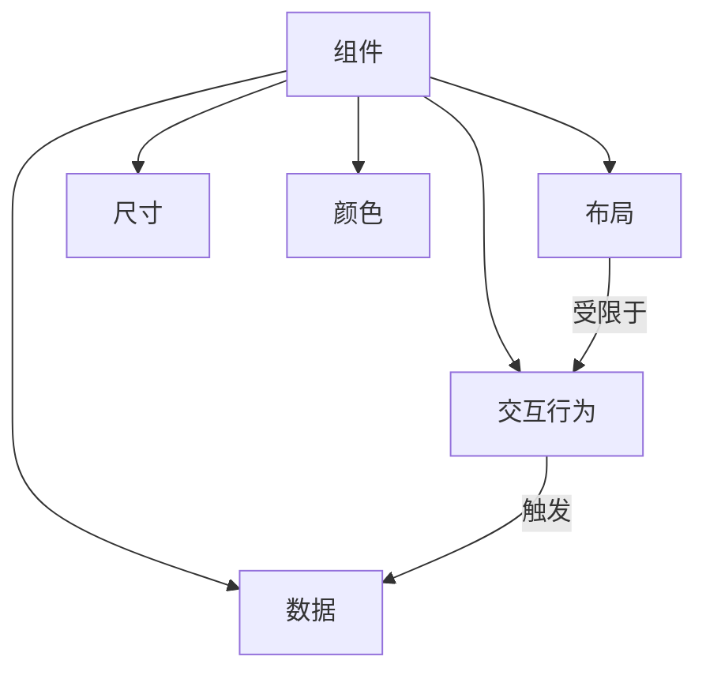

# 组件设计规范

查看 [README.md](./README.md) 获取英文版本.

## 1. 组件组成

组件由以下五个核心未读构成

| 维度     | 描述                                                                                                | 示例 |
| -------- | --------------------------------------------------------------------------------------------------- | ---- |
| 数据     | 使用 checkbox radio 表单元素、focus hover css 伪类，记录组件状态 抽屉组件是否弹出、下拉组件是否激活 |      |
| 交互行为 | 在特定情况下，展示，或隐藏元素。予以用户交互反馈                                                    |      |
| 布局     | 被交互行为决定的结构，及子元素排列方式                                                              |      |
| 尺寸     | 对原组件起大小限定作用，但不影响布局、交互行为                                                      |      |
| 颜色     | 对原组件起交互反馈增强效果，但不影响交互                                                            |      |

由于实际开发过程中，部分组件的交互行为会决定视觉效果。

故将视觉效果分离为三个部分。

其中，布局是被交互行为决定的结构。尺寸，与颜色与原组件无直接关系。

## 2. 维度边界规范

### 2.1 交集处理原则

- 布局与尺寸

  如 card 有单独的大 中 小 三个尺寸定义

  但 card 圆角被定义在布局中

- 布局与颜色

  如 paper 有 paperPrimary paperSecondary 两种颜色定义

  而 preview 的布局背景为重复的圆点

## 3. 设计原则

1. 明确边界：文档中标注布局与交互行为的关系
2. 可扩展性：尺寸与颜色应支持组合
3. 单一职责：尺寸或颜色只承担一个维度的责任

## 4. CSS 选择器规范

1. **选择器权重原则**
   - 默认情况下，选择器优先级应尽可能低
   - 避免使用ID选择器（`#id`）
   - 优先使用类选择器（`.class`）和元素选择器
   - 减少选择器的嵌套层级

2. **组件内聚场景**
   - 当处理组件内部相关的样式时，允许使用组件相关的特定选择器
   - 组件作用域内的选择器可以有适当的特异性
   - 选择器应清晰表达组件的结构关系

3. **最佳实践**
   - JavaScript 变量命名应反映组件的五个核心维度：
     - 基础布局：使用组件名作为基础，如 `card`
     - 数据状态：使用状态描述，如 `cardActive`, `cardOpen`
     - 交互行为：使用行为描述，如 `cardInteractive`, `cardHoverable`
     - 尺寸变体：使用尺寸描述，如 `cardSmall`, `cardLarge`
     - 颜色变体：使用颜色描述，如 `cardPrimary`, `cardSecondary`
   - 使用 Sprinkles 处理可组合的样式变体，如 `cardSprinkles`
   - 避免使用全局样式和 `!important`
   - 确保变量名清晰表达样式的用途和所属维度
   - 保持样式定义的独立性和可维护性

# FOUC 问题
