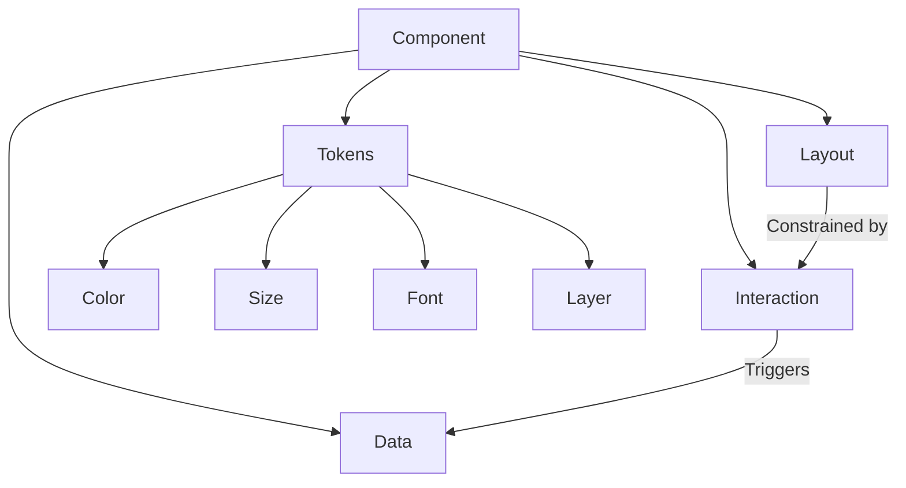

# Component Design Guidelines

See [README-zh.md](./README-zh.md) for the Chinese version.

## 1. Component Composition

A component consists of the following five core dimensions:

| Dimension   | Description                                                                                                                                                                 | Example |
| ----------- | --------------------------------------------------------------------------------------------------------------------------------------------------------------------------- | ------- |
| Data        | Uses checkbox, radio form elements, focus and hover CSS pseudo-classes to record component state. For example, whether a drawer component is open, or a dropdown is active. |         |
| Interaction | Shows or hides elements under specific conditions, providing user feedback.                                                                                                 |         |
| Layout      | The structure determined by interaction behavior, and the arrangement of child elements.                                                                                    |         |
| Tokens      | Design tokens that define visual and scale primitives (color, size, typography, and layer). Size tokens restrict component dimensions while color tokens enhance feedback; font and layer tokens define typography scale and stacking/layering. |         |

In actual development, some component interactions determine visual effects.

Therefore, visual effects are separated into three parts.

Among them, layout is the structure determined by interaction behavior. Tokens (color, size, font, layer) are separate design primitives not tied to a single component's interaction logic.

## 2. Dimension Boundary Guidelines

### 2.1 Intersection Handling Principles

- Layout and Tokens

  For example, a card can have separate size tokens such as large, medium, and small. Border radius and structural details remain part of the layout tokenization and should be defined in layout styles rather than in size tokens.

  Color tokens (e.g., `paperPrimary`, `paperSecondary`) control semantic colors used across components. Layouts like `preview` can combine color tokens with layout-specific backgrounds (e.g., repeated dots).

## 3. Design Principles

1. Clear boundaries: Document the relationship between layout and interaction behavior.
2. Extensibility: Tokens (color, size, font, layer) should be composable and support combination.
3. Single responsibility: Tokens should have single responsibility; e.g., size tokens control scale, color tokens control semantic color values.

## 4. CSS Selector Guidelines

1. **Selector Weight Principles**
   - Selector specificity should be as low as possible by default
   - Avoid using ID selectors (`#id`)
   - Prefer class selectors (`.class`) and element selectors
   - Minimize selector nesting levels

2. **Component Cohesion Scenarios**
   - Component-specific selectors are allowed when handling styles within components
   - Selectors within component scope can have appropriate specificity
   - Selectors should clearly express component structure relationships

3. **Best Practices**
   - JavaScript variable naming should reflect the five core dimensions:
     - Base layout: Use component name as base, e.g., `card`
     - Data state: Use state descriptors, e.g., `cardActive`, `cardOpen`
     - Interaction behavior: Use behavior descriptors, e.g., `cardInteractive`, `cardHoverable`
    - Tokens: Expose token-driven variants for `color`, `size`, `font`, and `layer`. Examples: `cardSmall` (size token), `cardPrimary` (color token), `bodyFont` (font token), `elevationLayer` (layer token).
   - Use Sprinkles for composable style variants, e.g., `cardSprinkles`
   - Avoid global styles and `!important`
   - Ensure variable names clearly express style purpose and dimension
   - Maintain style definition independence and maintainability

# FOUC Issue
