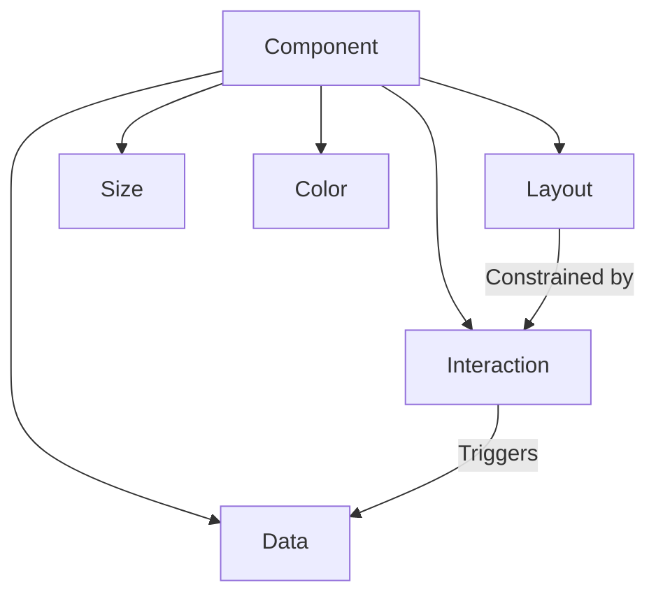

# Component Design Guidelines

See [README-zh.md](./README-zh.md) for the Chinese version.

## 1. Component Composition

A component consists of the following five core dimensions:

| Dimension   | Description                                                                                                                                                                 | Example |
| ----------- | --------------------------------------------------------------------------------------------------------------------------------------------------------------------------- | ------- |
| Data        | Uses checkbox, radio form elements, focus and hover CSS pseudo-classes to record component state. For example, whether a drawer component is open, or a dropdown is active. |         |
| Interaction | Shows or hides elements under specific conditions, providing user feedback.                                                                                                 |         |
| Layout      | The structure determined by interaction behavior, and the arrangement of child elements.                                                                                    |         |
| Size        | Restricts the size of the original component, but does not affect layout or interaction.                                                                                    |         |
| Color       | Enhances interaction feedback for the original component, but does not affect interaction itself.                                                                           |         |

In actual development, some component interactions determine visual effects.

Therefore, visual effects are separated into three parts.

Among them, layout is the structure determined by interaction behavior. Size and Color are not directly related to the original component.

## 2. Dimension Boundary Guidelines

### 2.1 Intersection Handling Principles

- Layout and Size

  For example, a card has separate definitions for large, medium, and small sizes.

  However, the card's border radius is defined in the layout.

- Layout and Color

  For example, paper has two color definitions: paperPrimary and paperSecondary.

  The layout background of preview uses repeated dots.

## 3. Design Principles

1. Clear boundaries: Document the relationship between layout and interaction behavior.
2. Extensibility: Size and color should support combinations.
3. Single responsibility: Size or color should only be responsible for one dimension.

# FOUC Issue
