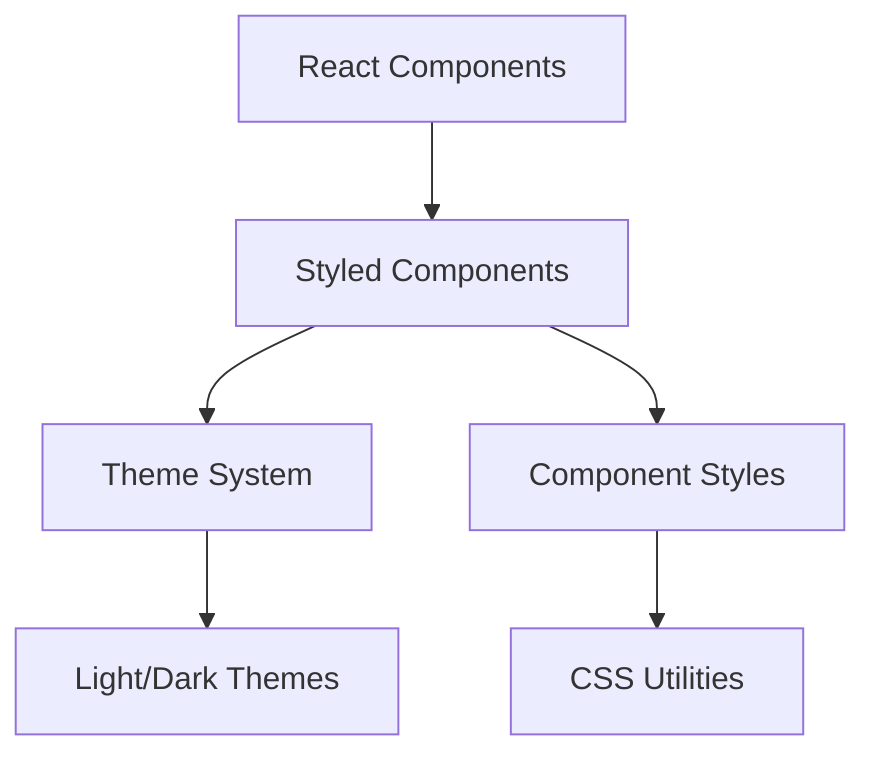

# System Patterns

## Architecture Overview

## Package Structure
### camphora-react
- Core React components
- Component logic and behavior
- TypeScript definitions
- Component composition patterns

### camphora-styled
- Styled-components implementation
- Theme contracts and definitions
- CSS utilities and sprinkles
- Common style patterns

## Design Patterns

### Component Architecture
1. **Composition Over Inheritance**
   - Components are built using smaller, reusable pieces
   - Props provide customization options
   - Context for shared state/theme

2. **Controlled vs Uncontrolled**
   - Support both patterns where appropriate
   - Default to uncontrolled for simpler use cases
   - Provide controlled API for complex state management

### Styling Patterns
1. **Theme Contracts**
   - Defined in themeContracts.css.ts
   - Consistent color and style variables
   - Light/dark theme support

2. **CSS Utilities**
   - Sprinkles for common style variations
   - Reusable style patterns
   - Performance optimized CSS generation

### State Management
1. **Component State**
   - Local state for UI interactions
   - Context for theme and shared state
   - Props for controlled components

2. **Theme System**
   - Theme provider at the root
   - Theme switching support
   - Custom theme extensions

## Implementation Paths

### Component Development
1. Define component interface (TypeScript)
2. Implement core functionality (React)
3. Add styled-components integration
4. Implement theme support
5. Add documentation and examples

### Style System
1. Define theme contracts
2. Implement base styles
3. Add theme variations
4. Create utility classes
5. Optimize for performance

## Testing Strategy
1. Component unit tests
2. Theme system tests
3. Integration tests
4. Visual regression tests
5. Accessibility testing

## Documentation
1. Component API docs
2. Usage examples
3. Theme customization
4. Best practices
5. Quick start guides
